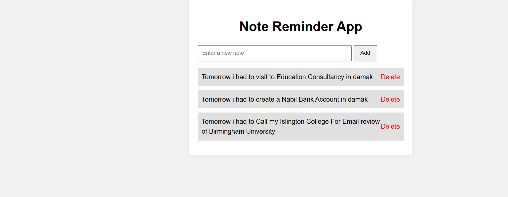

# Note Reminder App

This is a simple Flask-based note and reminder application where you can add, view, and manage your daily tasks.

## Features

✅ Add new tasks  
✅ Mark tasks as complete  
✅ Delete tasks  
✅ View all tasks  

## Screenshot



## Setup Instructions

1. Clone this repository:
   ```bash
   git clone <your-repo-url>
